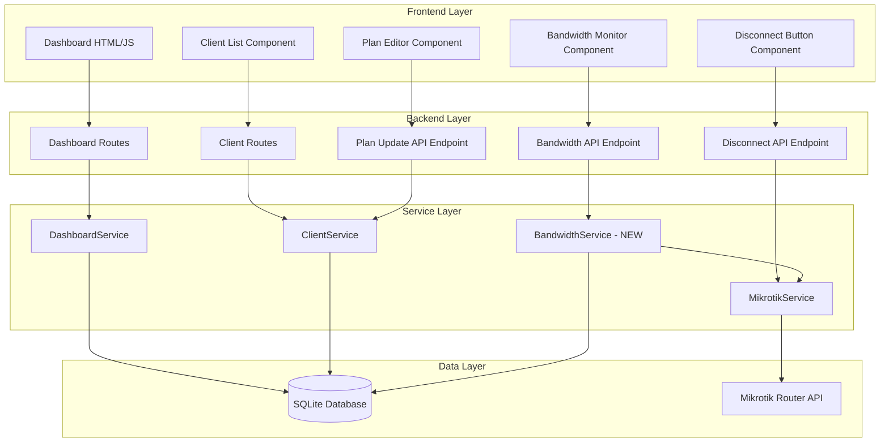
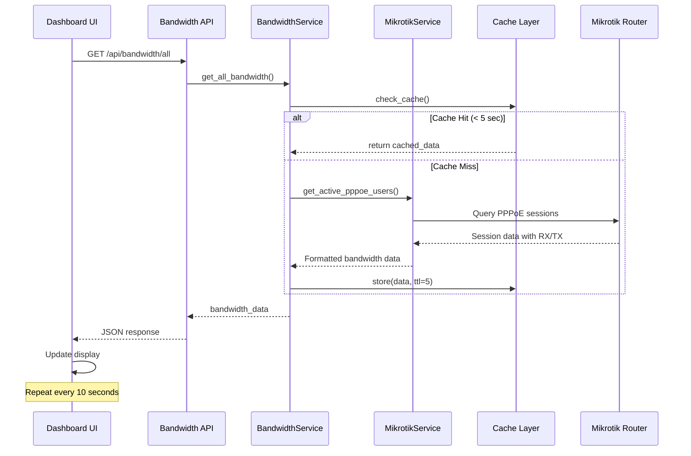
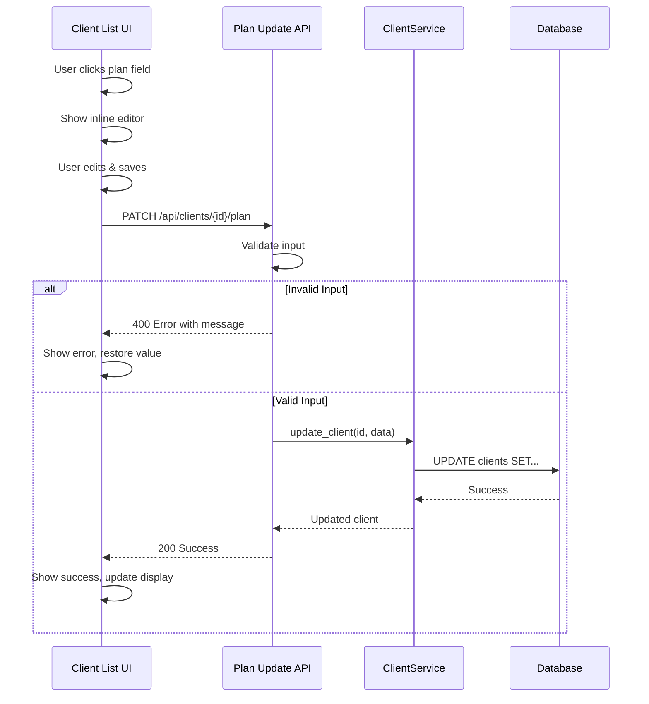
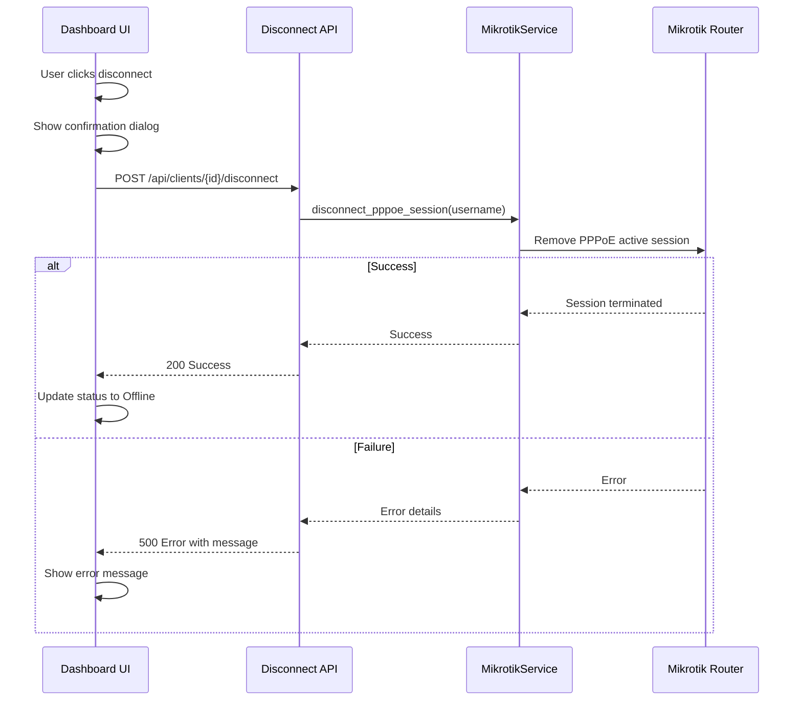

# Design Document: Admin Dashboard Enhancements

## Overview

Ang feature na ito ay magdadagdag ng tatlong pangunahing capabilities sa existing admin dashboard ng ISP Billing System:

1. **Inline Plan Editing** - Nagbibigay ng mabilis na pag-edit ng plan name at plan amount nang direkta mula sa client list, eliminating ang need na mag-navigate sa separate edit page
2. **Real-time Bandwidth Monitoring** - Nagpapakita ng current RX/TX bandwidth usage ng bawat client at ng total ISP bandwidth, with congestion indicators
3. **Quick Disconnect Functionality** - Nagbibigay ng one-click disconnect button para sa bawat online client

Ang design ay naka-integrate sa existing Flask application architecture at gumagamit ng existing MikrotikService para sa router communication. Ang implementation ay focused sa minimal changes sa existing codebase habang nagdadagdag ng significant value sa admin workflow.

### Key Design Decisions

- **Frontend-heavy approach**: Ang inline editing at bandwidth monitoring ay primarily JavaScript-based para sa responsive user experience
- **Polling-based updates**: Ang bandwidth data ay nag-update every 10 seconds via AJAX calls instead of WebSockets para sa simplicity
- **Caching strategy**: Ang Mikrotik API calls ay naka-cache for 5 seconds para hindi ma-overwhelm ang router
- **Graceful degradation**: Kung ang Mikrotik connection ay down, ang dashboard ay patuloy na functional with appropriate error messages

## Architecture

### High-Level Architecture



### Component Interaction Flow

**Bandwidth Monitoring Flow:**


**Inline Plan Edit Flow:**


**Disconnect Flow:**


## Components and Interfaces

### 1. BandwidthService (NEW)

Ang bagong service na nag-handle ng bandwidth data retrieval at aggregation.

```python
class BandwidthService:
    """Service for bandwidth monitoring and aggregation"""
    
    @staticmethod
    def get_client_bandwidth(client_id: int) -> dict:
        """
        Get bandwidth data for a specific client.
        
        Args:
            client_id: Client database ID
            
        Returns:
            dict: {
                'client_id': int,
                'pppoe_username': str,
                'is_online': bool,
                'rx_mbps': float,
                'tx_mbps': float,
                'last_updated': datetime
            }
        """
        pass
    
    @staticmethod
    def get_all_bandwidth() -> list[dict]:
        """
        Get bandwidth data for all clients.
        Uses caching to minimize Mikrotik API calls.
        
        Returns:
            list[dict]: List of bandwidth data per client
        """
        pass
    
    @staticmethod
    def get_total_bandwidth() -> dict:
        """
        Get aggregated total bandwidth for ISP.
        
        Returns:
            dict: {
                'total_rx_mbps': float,
                'total_tx_mbps': float,
                'active_sessions': int,
                'threshold_rx': float,
                'threshold_tx': float,
                'congestion_status': str  # 'normal', 'warning', 'critical'
            }
        """
        pass
    
    @staticmethod
    def calculate_congestion_status(current: float, threshold: float) -> str:
        """
        Calculate congestion status based on threshold.
        
        Args:
            current: Current bandwidth usage in Mbps
            threshold: Configured threshold in Mbps
            
        Returns:
            str: 'normal' (<80%), 'warning' (80-100%), 'critical' (>100%)
        """
        pass
```

### 2. MikrotikService Extensions

Mga bagong methods na idadagdag sa existing MikrotikService.

```python
class MikrotikService:
    # ... existing methods ...
    
    def get_session_bandwidth(self, username: str) -> dict:
        """
        Get bandwidth data for specific PPPoE session.
        
        Args:
            username: PPPoE username
            
        Returns:
            dict: {
                'username': str,
                'rx_bytes_per_sec': int,
                'tx_bytes_per_sec': int,
                'rx_mbps': float,
                'tx_mbps': float
            }
        
        Raises:
            RouterOsApiConnectionError: If connection fails
            RouterOsApiCommunicationError: If API call fails
        """
        pass
    
    def get_all_sessions_bandwidth(self) -> list[dict]:
        """
        Get bandwidth data for all active PPPoE sessions.
        Uses batch query for efficiency.
        
        Returns:
            list[dict]: Bandwidth data for all sessions
        """
        pass
    
    def disconnect_pppoe_session(self, username: str) -> bool:
        """
        Terminate active PPPoE session for user.
        
        Args:
            username: PPPoE username to disconnect
            
        Returns:
            bool: True if disconnected successfully
            
        Raises:
            RouterOsApiConnectionError: If connection fails
            RouterOsApiCommunicationError: If API call fails
            ValueError: If user not found or not online
        """
        pass
```

### 3. API Endpoints (NEW)

Mga bagong REST API endpoints para sa frontend.

#### GET /api/bandwidth/all
```json
Response 200:
{
  "success": true,
  "data": [
    {
      "client_id": 1,
      "pppoe_username": "client001",
      "full_name": "Juan Dela Cruz",
      "is_online": true,
      "rx_mbps": 5.2,
      "tx_mbps": 1.8
    },
    ...
  ],
  "timestamp": "2024-01-15T10:30:00Z"
}

Response 500:
{
  "success": false,
  "error": "Hindi maka-connect sa Mikrotik router"
}
```

#### GET /api/bandwidth/total
```json
Response 200:
{
  "success": true,
  "data": {
    "total_rx_mbps": 125.5,
    "total_tx_mbps": 45.2,
    "active_sessions": 24,
    "threshold_rx": 200.0,
    "threshold_tx": 100.0,
    "congestion_status_rx": "normal",
    "congestion_status_tx": "normal"
  },
  "timestamp": "2024-01-15T10:30:00Z"
}
```

#### PATCH /api/clients/{id}/plan
```json
Request:
{
  "plan_name": "Fiber 50Mbps",
  "plan_amount": 1500.00
}

Response 200:
{
  "success": true,
  "data": {
    "id": 1,
    "plan_name": "Fiber 50Mbps",
    "plan_amount": 1500.00
  },
  "message": "Plan successfully updated"
}

Response 400:
{
  "success": false,
  "error": "Plan amount must be greater than 0"
}
```

#### POST /api/clients/{id}/disconnect
```json
Response 200:
{
  "success": true,
  "message": "Client successfully disconnected"
}

Response 404:
{
  "success": false,
  "error": "Client is not online"
}

Response 500:
{
  "success": false,
  "error": "Failed to disconnect: Connection timeout"
}
```

### 4. Frontend Components

#### Bandwidth Monitor Component (JavaScript)

```javascript
class BandwidthMonitor {
  constructor(updateInterval = 10000) {
    this.updateInterval = updateInterval;
    this.isRunning = false;
  }
  
  start() {
    // Start polling for bandwidth data
  }
  
  stop() {
    // Stop polling
  }
  
  async fetchBandwidthData() {
    // Fetch from /api/bandwidth/all
  }
  
  async fetchTotalBandwidth() {
    // Fetch from /api/bandwidth/total
  }
  
  updateClientRow(clientId, bandwidthData) {
    // Update specific client row in table
  }
  
  updateTotalDisplay(totalData) {
    // Update total bandwidth display with congestion indicators
  }
  
  showCongestionIndicator(status) {
    // Show normal/warning/critical indicator
  }
}
```

#### Inline Plan Editor Component (JavaScript)

```javascript
class InlinePlanEditor {
  constructor(clientId, fieldName, currentValue) {
    this.clientId = clientId;
    this.fieldName = fieldName;
    this.currentValue = currentValue;
    this.originalValue = currentValue;
  }
  
  activate() {
    // Convert display to editable input
  }
  
  async save() {
    // Validate and send PATCH request
  }
  
  cancel() {
    // Restore original value
  }
  
  validate(value) {
    // Validate input based on field type
  }
  
  showError(message) {
    // Display error message
  }
  
  showSuccess() {
    // Display success message
  }
}
```

#### Disconnect Button Component (JavaScript)

```javascript
class DisconnectButton {
  constructor(clientId, username) {
    this.clientId = clientId;
    this.username = username;
  }
  
  async disconnect() {
    // Show confirmation dialog
    // Send POST request to /api/clients/{id}/disconnect
    // Update UI on success/failure
  }
  
  showConfirmation() {
    // Show confirmation dialog
  }
  
  updateClientStatus(isOnline) {
    // Update client status display
  }
}
```

## Data Models

### Existing Models (No Changes)

Ang existing Client model ay sapat na para sa feature na ito. Walang kailangang database schema changes.

```python
class Client(db.Model):
    id = db.Column(db.Integer, primary_key=True)
    full_name = db.Column(db.String(120), nullable=False)
    pppoe_username = db.Column(db.String(80), unique=True, nullable=False)
    plan_name = db.Column(db.String(100), nullable=False)
    plan_amount = db.Column(db.Float, nullable=False)
    status = db.Column(db.String(20), nullable=False, default='active')
    # ... other fields ...
```

### Configuration Model (NEW - Optional)

Para sa bandwidth threshold configuration, pwedeng gumamit ng simple config table o environment variables.

**Option 1: Environment Variables (Recommended)**
```python
# config.py
BANDWIDTH_THRESHOLD_RX = float(os.getenv('BANDWIDTH_THRESHOLD_RX', '200.0'))
BANDWIDTH_THRESHOLD_TX = float(os.getenv('BANDWIDTH_THRESHOLD_TX', '100.0'))
BANDWIDTH_CACHE_TTL = int(os.getenv('BANDWIDTH_CACHE_TTL', '5'))
BANDWIDTH_UPDATE_INTERVAL = int(os.getenv('BANDWIDTH_UPDATE_INTERVAL', '10'))
```

**Option 2: Database Table (Future Enhancement)**
```python
class SystemConfig(db.Model):
    __tablename__ = 'system_config'
    
    id = db.Column(db.Integer, primary_key=True)
    key = db.Column(db.String(100), unique=True, nullable=False)
    value = db.Column(db.String(255), nullable=False)
    description = db.Column(db.String(255))
    updated_at = db.Column(db.DateTime, default=datetime.utcnow)
```

### Cache Structure (In-Memory)

Para sa bandwidth data caching, gagamitin ang simple Python dictionary with timestamp.

```python
# In BandwidthService
_bandwidth_cache = {
    'data': None,
    'timestamp': None,
    'ttl': 5  # seconds
}

def _is_cache_valid():
    if _bandwidth_cache['data'] is None:
        return False
    elapsed = (datetime.now() - _bandwidth_cache['timestamp']).total_seconds()
    return elapsed < _bandwidth_cache['ttl']
```


## Correctness Properties

*Ang property ay isang katangian o behavior na dapat totoo sa lahat ng valid executions ng system - essentially, isang formal statement tungkol sa kung ano ang dapat gawin ng system. Ang mga properties ay nagsisilbing tulay sa pagitan ng human-readable specifications at machine-verifiable correctness guarantees.*

### Property Reflection

Bago isulat ang final properties, nag-review ako ng lahat ng testable criteria mula sa prework analysis para i-eliminate ang redundancy:

**Identified Redundancies:**
- Properties 2.2 at 2.3 (RX at TX display) ay pwedeng i-combine into one property about bandwidth data completeness
- Properties 3.1 at 3.2 (total RX at TX calculation) ay pwedeng i-combine into one property about total bandwidth calculation
- Properties 3.3 at 3.4 (RX at TX display sa dashboard) ay covered na ng general UI rendering tests
- Properties 3.6 at 3.7 (warning at critical indicators) ay pwedeng i-combine into one property about congestion status calculation
- Properties 5.2 at 5.3 (RX at TX rate retrieval) ay pwedeng i-combine into one property about bandwidth data retrieval
- Properties 6.2 at 6.3 (error messages) ay pwedeng i-combine into one property about error handling

**Final Property Set:**
After reflection, nag-consolidate ako ng 30+ testable criteria into 15 unique, non-redundant properties na nag-provide ng comprehensive coverage.

### Property 1: Plan Update Persistence

*Para sa kahit anong* valid plan name at plan amount, kapag na-save ang changes sa database, ang subsequent query sa client record ay dapat mag-return ng updated values.

**Validates: Requirements 1.2**

### Property 2: Invalid Plan Rejection

*Para sa kahit anong* invalid plan input (negative amount, empty plan name, non-numeric amount), ang system ay dapat mag-reject ng update at mag-return ng appropriate error message.

**Validates: Requirements 1.3**

### Property 3: Edit Cancellation Restores Original

*Para sa kahit anong* client plan field, kapag nag-edit then cancel ang admin, ang displayed value ay dapat exactly equal sa original value bago mag-edit.

**Validates: Requirements 1.5**

### Property 4: Bandwidth Data Completeness

*Para sa bawat* active PPPoE session, ang returned bandwidth data ay dapat may both RX at TX values na naka-convert sa Mbps.

**Validates: Requirements 2.2, 2.3, 5.2, 5.3**

### Property 5: Total Bandwidth Calculation Accuracy

*Para sa kahit anong* set ng active PPPoE sessions, ang total RX ay dapat equal sa sum ng lahat ng individual RX values, at ang total TX ay dapat equal sa sum ng lahat ng individual TX values.

**Validates: Requirements 3.1, 3.2**

### Property 6: Congestion Status Correctness

*Para sa kahit anong* current bandwidth value at configured threshold, ang congestion status ay dapat:
- "normal" kung current < 80% ng threshold
- "warning" kung 80% <= current <= 100% ng threshold  
- "critical" kung current > 100% ng threshold

**Validates: Requirements 3.6, 3.7**

### Property 7: Threshold Configuration Persistence

*Para sa kahit anong* valid threshold value (positive number), kapag na-save ang configuration, ang subsequent query ay dapat mag-return ng same threshold value.

**Validates: Requirements 3.8**

### Property 8: Disconnect Button Visibility

*Para sa kahit anong* client, ang disconnect button ay dapat visible kung at only kung ang client ay may active PPPoE session.

**Validates: Requirements 4.1, 4.2**

### Property 9: Successful Disconnect Updates Status

*Para sa kahit anong* online client, kapag successful ang disconnect operation, ang client status ay dapat mag-update to offline at ang bandwidth display ay dapat mag-show ng "Offline" status.

**Validates: Requirements 4.5, 4.8**

### Property 10: Failed Operations Return Errors

*Para sa kahit anong* failed operation (disconnect, plan update, bandwidth fetch), ang system ay dapat mag-return ng error response na may descriptive error message.

**Validates: Requirements 4.6, 6.2, 6.3**

### Property 11: Bandwidth Unit Conversion Accuracy

*Para sa kahit anong* bandwidth value sa bytes per second, ang conversion to Mbps ay dapat accurate: `mbps = (bytes_per_sec * 8) / (1024 * 1024)`.

**Validates: Requirements 5.4**

### Property 12: Cache Prevents Redundant API Calls

*Para sa kahit anong* sequence ng bandwidth requests within 5 seconds, ang system ay dapat gumamit ng cached data at hindi mag-trigger ng bagong Mikrotik API call.

**Validates: Requirements 5.6**

### Property 13: Username Matching Correctness

*Para sa kahit anong* PPPoE session username, ang system ay dapat correctly match ito sa corresponding client record sa database based on pppoe_username field.

**Validates: Requirements 5.7**

### Property 14: Batch Query Efficiency

*Para sa kahit anong* request na nag-fetch ng bandwidth data for multiple clients, ang system ay dapat gumawa ng single batch query sa Mikrotik instead of individual queries per client.

**Validates: Requirements 7.1**

### Property 15: Pagination Triggers at Threshold

*Para sa kahit anong* client list, ang pagination ay dapat mag-activate kung at only kung ang total number of clients ay greater than 50.

**Validates: Requirements 7.2**

### Property 16: Lazy Loading for Visible Clients Only

*Para sa kahit anong* paginated page, ang system ay dapat mag-load ng bandwidth data only for clients na visible sa current page, hindi para sa lahat ng clients.

**Validates: Requirements 7.4**

### Property 17: Concurrent Request Limiting

*Para sa kahit anong* sequence ng Mikrotik API requests, ang system ay dapat hindi mag-exceed ng 5 concurrent requests at any given time.

**Validates: Requirements 7.6**


## Error Handling

Ang error handling strategy ay naka-design para sa graceful degradation at clear user feedback.

### Error Categories

#### 1. Mikrotik Connection Errors

**Scenario:** Ang Mikrotik router ay hindi available o hindi maka-connect.

**Handling:**
- Catch `RouterOsApiConnectionError` sa service layer
- Return error status with message: "Hindi maka-connect sa Mikrotik router"
- Frontend displays error banner sa dashboard
- Bandwidth monitoring ay nag-stop temporarily
- Retry connection after 30 seconds
- Admin ay pwede pa ring mag-edit ng plans at view client data

**Example:**
```python
try:
    mikrotik = MikrotikService(...)
    bandwidth_data = mikrotik.get_all_sessions_bandwidth()
except RouterOsApiConnectionError as e:
    logger.error(f"Mikrotik connection failed: {str(e)}")
    return {
        'success': False,
        'error': 'Hindi maka-connect sa Mikrotik router',
        'retry_after': 30
    }
```

#### 2. Invalid Input Errors

**Scenario:** Ang admin ay nag-input ng invalid data sa plan editor.

**Validation Rules:**
- Plan name: Hindi pwedeng empty, max 100 characters
- Plan amount: Dapat positive number, max 2 decimal places

**Handling:**
- Validate sa frontend bago mag-send ng request
- Validate ulit sa backend para sa security
- Return 400 Bad Request with specific error message
- Frontend displays error inline sa editor
- Original value ay naka-preserve

**Example:**
```python
def validate_plan_data(data):
    errors = []
    
    if not data.get('plan_name') or not data['plan_name'].strip():
        errors.append('Plan name ay required')
    
    if len(data.get('plan_name', '')) > 100:
        errors.append('Plan name ay maximum 100 characters lang')
    
    try:
        amount = float(data.get('plan_amount', 0))
        if amount <= 0:
            errors.append('Plan amount ay dapat greater than 0')
    except ValueError:
        errors.append('Plan amount ay dapat valid number')
    
    return errors
```

#### 3. Disconnect Operation Errors

**Scenario:** Ang disconnect operation ay nabigo.

**Possible Causes:**
- Client ay already offline
- Mikrotik connection timeout
- Session not found sa router
- Permission denied

**Handling:**
- Catch specific exceptions sa MikrotikService
- Return appropriate HTTP status code (404, 500, 403)
- Include troubleshooting hints sa error message
- Log detailed error para sa debugging

**Error Messages:**
- "Client is not online" (404) - Client ay wala nang active session
- "Failed to disconnect: Connection timeout" (500) - Mikrotik ay hindi nag-respond
- "Session not found in router" (404) - Session ay nawala na
- "Access denied" (403) - Admin ay walang permission

#### 4. Timeout Errors

**Scenario:** Ang Mikrotik API call ay tumatagal ng more than 5 seconds.

**Handling:**
- Set timeout sa API calls: `timeout=5`
- Catch timeout exception
- Display warning message: "Bandwidth update ay tumatagal. Please wait..."
- After 10 seconds, display error: "Request timeout. Please refresh."
- Provide manual refresh button

#### 5. Cache Errors

**Scenario:** Ang cache ay corrupted o invalid.

**Handling:**
- Validate cache data structure bago gamitin
- If invalid, clear cache at fetch fresh data
- Log cache errors para sa monitoring
- Never crash ang application dahil sa cache issues

**Example:**
```python
def get_cached_bandwidth():
    try:
        if _is_cache_valid():
            data = _bandwidth_cache['data']
            # Validate structure
            if isinstance(data, list) and all('rx_mbps' in item for item in data):
                return data
            else:
                logger.warning("Invalid cache structure, clearing cache")
                _clear_cache()
    except Exception as e:
        logger.error(f"Cache error: {str(e)}")
        _clear_cache()
    
    return None
```

### Error Response Format

Lahat ng API endpoints ay nag-return ng consistent error format:

```json
{
  "success": false,
  "error": "Human-readable error message",
  "error_code": "MIKROTIK_CONNECTION_ERROR",
  "details": {
    "field": "plan_amount",
    "reason": "Must be greater than 0"
  },
  "timestamp": "2024-01-15T10:30:00Z"
}
```

### Frontend Error Display

**Error Banner (Top of Dashboard):**
- Red background para sa critical errors (Mikrotik down)
- Yellow background para sa warnings (slow response)
- Auto-dismiss after 5 seconds para sa non-critical errors
- Persistent para sa critical errors with manual dismiss button

**Inline Errors (Plan Editor):**
- Red border sa input field
- Error message below field
- Error icon beside field
- Clear on focus

**Toast Notifications:**
- Bottom-right corner
- 3 seconds display time
- Stack multiple notifications
- Click to dismiss

### Logging Strategy

**Log Levels:**
- `ERROR`: Mikrotik connection failures, API errors, unexpected exceptions
- `WARNING`: Slow responses, cache misses, validation failures
- `INFO`: Successful operations, cache hits, normal flow
- `DEBUG`: Detailed request/response data, timing information

**Log Format:**
```
[2024-01-15 10:30:00] ERROR [BandwidthService] Mikrotik connection failed: Connection timeout after 5s (client_id=123, username=client001)
```

## Testing Strategy

Ang testing strategy ay naka-design para sa comprehensive coverage gamit ang combination ng unit tests at property-based tests.

### Testing Approach

**Dual Testing Strategy:**
- **Unit Tests**: Para sa specific examples, edge cases, at integration points
- **Property-Based Tests**: Para sa universal properties across all inputs

Ang dalawang approach na ito ay complementary - ang unit tests ay nag-catch ng specific bugs, habang ang property tests ay nag-verify ng general correctness across wide range of inputs.

### Property-Based Testing Configuration

**Library:** `hypothesis` (Python)

**Installation:**
```bash
pip install hypothesis
```

**Configuration:**
```python
from hypothesis import settings, HealthCheck

# Global settings
settings.register_profile("default", max_examples=100, deadline=None)
settings.load_profile("default")
```

**Test Tagging Format:**
Bawat property test ay may comment na nag-reference sa design document property:

```python
def test_plan_update_persistence():
    """
    Feature: admin-dashboard-enhancements, Property 1: Plan Update Persistence
    
    Para sa kahit anong valid plan name at plan amount, kapag na-save ang changes
    sa database, ang subsequent query sa client record ay dapat mag-return ng
    updated values.
    """
    # Test implementation
```

### Unit Test Coverage

**1. Inline Plan Editing Tests**

```python
# tests/test_plan_editor.py

def test_plan_editor_displays_on_click():
    """Test that clicking plan field shows editable input"""
    # Specific example test
    
def test_plan_editor_validates_negative_amount():
    """Test that negative amounts are rejected"""
    # Edge case test
    
def test_plan_editor_validates_empty_name():
    """Test that empty plan names are rejected"""
    # Edge case test
    
def test_plan_editor_shows_success_message():
    """Test that success message appears after save"""
    # UI feedback test
```

**2. Bandwidth Monitoring Tests**

```python
# tests/test_bandwidth_service.py

def test_bandwidth_fetch_with_mikrotik_down():
    """Test graceful handling when Mikrotik is offline"""
    # Edge case test
    
def test_bandwidth_display_for_offline_client():
    """Test that offline clients show 'Offline' status"""
    # Edge case test
    
def test_bandwidth_cache_hit():
    """Test that cache is used within TTL"""
    # Specific example test
    
def test_bandwidth_cache_miss():
    """Test that fresh data is fetched after TTL"""
    # Specific example test
```

**3. Disconnect Functionality Tests**

```python
# tests/test_disconnect.py

def test_disconnect_button_visible_for_online_client():
    """Test that disconnect button shows for online clients"""
    # Specific example test
    
def test_disconnect_button_hidden_for_offline_client():
    """Test that disconnect button is hidden for offline clients"""
    # Edge case test
    
def test_disconnect_shows_confirmation_dialog():
    """Test that confirmation dialog appears on click"""
    # UI interaction test
    
def test_disconnect_with_mikrotik_error():
    """Test error handling when disconnect fails"""
    # Edge case test
```

**4. Error Handling Tests**

```python
# tests/test_error_handling.py

def test_mikrotik_connection_error_message():
    """Test that connection errors show appropriate message"""
    # Edge case test
    
def test_timeout_warning_display():
    """Test that timeout warnings appear after 5 seconds"""
    # Edge case test
    
def test_access_denied_message():
    """Test that unauthorized access shows access denied"""
    # Edge case test
```

### Property-Based Test Coverage

**1. Plan Update Properties**

```python
# tests/property_tests/test_plan_properties.py

from hypothesis import given, strategies as st

@given(
    plan_name=st.text(min_size=1, max_size=100),
    plan_amount=st.floats(min_value=0.01, max_value=999999.99)
)
def test_plan_update_persistence(plan_name, plan_amount):
    """
    Feature: admin-dashboard-enhancements, Property 1: Plan Update Persistence
    """
    # Create client
    client = create_test_client()
    
    # Update plan
    update_client_plan(client.id, plan_name, plan_amount)
    
    # Query back
    updated_client = get_client(client.id)
    
    # Verify
    assert updated_client.plan_name == plan_name
    assert updated_client.plan_amount == plan_amount

@given(
    plan_amount=st.one_of(
        st.floats(max_value=-0.01),  # Negative
        st.just(0),  # Zero
        st.text()  # Non-numeric
    )
)
def test_invalid_plan_rejection(plan_amount):
    """
    Feature: admin-dashboard-enhancements, Property 2: Invalid Plan Rejection
    """
    client = create_test_client()
    
    # Attempt update with invalid amount
    result = update_client_plan(client.id, "Valid Name", plan_amount)
    
    # Verify rejection
    assert result['success'] is False
    assert 'error' in result

@given(
    original_name=st.text(min_size=1, max_size=100),
    original_amount=st.floats(min_value=0.01, max_value=999999.99),
    edited_name=st.text(min_size=1, max_size=100),
    edited_amount=st.floats(min_value=0.01, max_value=999999.99)
)
def test_edit_cancellation_restores_original(original_name, original_amount, 
                                             edited_name, edited_amount):
    """
    Feature: admin-dashboard-enhancements, Property 3: Edit Cancellation Restores Original
    """
    # Create client with original values
    client = create_test_client(plan_name=original_name, plan_amount=original_amount)
    
    # Start edit (simulate frontend state)
    editor = InlinePlanEditor(client.id, original_name, original_amount)
    editor.edit(edited_name, edited_amount)
    
    # Cancel
    editor.cancel()
    
    # Verify original values restored
    assert editor.current_value == original_name
    assert editor.current_amount == original_amount
```

**2. Bandwidth Calculation Properties**

```python
# tests/property_tests/test_bandwidth_properties.py

@given(
    sessions=st.lists(
        st.fixed_dictionaries({
            'username': st.text(min_size=1),
            'rx_bytes_per_sec': st.integers(min_value=0, max_value=1000000000),
            'tx_bytes_per_sec': st.integers(min_value=0, max_value=1000000000)
        }),
        min_size=1,
        max_size=100
    )
)
def test_bandwidth_data_completeness(sessions):
    """
    Feature: admin-dashboard-enhancements, Property 4: Bandwidth Data Completeness
    """
    # Mock Mikrotik response
    mock_mikrotik_response(sessions)
    
    # Fetch bandwidth data
    bandwidth_data = BandwidthService.get_all_bandwidth()
    
    # Verify completeness
    for data in bandwidth_data:
        assert 'rx_mbps' in data
        assert 'tx_mbps' in data
        assert isinstance(data['rx_mbps'], float)
        assert isinstance(data['tx_mbps'], float)

@given(
    sessions=st.lists(
        st.fixed_dictionaries({
            'username': st.text(min_size=1),
            'rx_mbps': st.floats(min_value=0, max_value=1000),
            'tx_mbps': st.floats(min_value=0, max_value=1000)
        }),
        min_size=0,
        max_size=100
    )
)
def test_total_bandwidth_calculation_accuracy(sessions):
    """
    Feature: admin-dashboard-enhancements, Property 5: Total Bandwidth Calculation Accuracy
    """
    # Mock bandwidth data
    mock_bandwidth_data(sessions)
    
    # Calculate expected totals
    expected_rx = sum(s['rx_mbps'] for s in sessions)
    expected_tx = sum(s['tx_mbps'] for s in sessions)
    
    # Get actual totals
    total_data = BandwidthService.get_total_bandwidth()
    
    # Verify accuracy (with floating point tolerance)
    assert abs(total_data['total_rx_mbps'] - expected_rx) < 0.01
    assert abs(total_data['total_tx_mbps'] - expected_tx) < 0.01

@given(
    current=st.floats(min_value=0, max_value=1000),
    threshold=st.floats(min_value=1, max_value=1000)
)
def test_congestion_status_correctness(current, threshold):
    """
    Feature: admin-dashboard-enhancements, Property 6: Congestion Status Correctness
    """
    status = BandwidthService.calculate_congestion_status(current, threshold)
    
    percentage = (current / threshold) * 100
    
    if percentage < 80:
        assert status == 'normal'
    elif 80 <= percentage <= 100:
        assert status == 'warning'
    else:
        assert status == 'critical'
```

**3. Disconnect and Status Properties**

```python
# tests/property_tests/test_disconnect_properties.py

@given(
    has_active_session=st.booleans()
)
def test_disconnect_button_visibility(has_active_session):
    """
    Feature: admin-dashboard-enhancements, Property 8: Disconnect Button Visibility
    """
    client = create_test_client()
    
    if has_active_session:
        mock_active_session(client.pppoe_username)
    else:
        mock_no_session(client.pppoe_username)
    
    # Check button visibility
    is_visible = should_show_disconnect_button(client.id)
    
    assert is_visible == has_active_session

@given(
    username=st.text(min_size=1, max_size=50)
)
def test_successful_disconnect_updates_status(username):
    """
    Feature: admin-dashboard-enhancements, Property 9: Successful Disconnect Updates Status
    """
    # Create online client
    client = create_test_client(pppoe_username=username)
    mock_active_session(username)
    
    # Disconnect
    result = disconnect_client(client.id)
    
    # Verify success
    assert result['success'] is True
    
    # Verify status updated
    is_online = is_client_online(client.id)
    assert is_online is False
```

**4. Conversion and Caching Properties**

```python
# tests/property_tests/test_conversion_properties.py

@given(
    bytes_per_sec=st.integers(min_value=0, max_value=10000000000)
)
def test_bandwidth_unit_conversion_accuracy(bytes_per_sec):
    """
    Feature: admin-dashboard-enhancements, Property 11: Bandwidth Unit Conversion Accuracy
    """
    expected_mbps = (bytes_per_sec * 8) / (1024 * 1024)
    
    actual_mbps = convert_bytes_to_mbps(bytes_per_sec)
    
    # Verify accuracy with floating point tolerance
    assert abs(actual_mbps - expected_mbps) < 0.001

@given(
    request_times=st.lists(
        st.floats(min_value=0, max_value=4.9),
        min_size=2,
        max_size=10
    )
)
def test_cache_prevents_redundant_api_calls(request_times):
    """
    Feature: admin-dashboard-enhancements, Property 12: Cache Prevents Redundant API Calls
    """
    # Clear cache
    clear_bandwidth_cache()
    
    # Track API calls
    api_call_count = 0
    
    # Make requests within 5 seconds
    for time_offset in request_times:
        sleep(time_offset)
        bandwidth_data = BandwidthService.get_all_bandwidth()
        if not _is_cache_valid():
            api_call_count += 1
    
    # Verify only one API call was made
    assert api_call_count == 1
```

**5. Performance Properties**

```python
# tests/property_tests/test_performance_properties.py

@given(
    client_count=st.integers(min_value=1, max_value=200)
)
def test_pagination_triggers_at_threshold(client_count):
    """
    Feature: admin-dashboard-enhancements, Property 15: Pagination Triggers at Threshold
    """
    # Create clients
    clients = [create_test_client() for _ in range(client_count)]
    
    # Check pagination
    should_paginate = should_enable_pagination(client_count)
    
    if client_count > 50:
        assert should_paginate is True
    else:
        assert should_paginate is False

@given(
    total_clients=st.integers(min_value=51, max_value=500),
    page_number=st.integers(min_value=1, max_value=10),
    page_size=st.just(50)
)
def test_lazy_loading_for_visible_clients_only(total_clients, page_number, page_size):
    """
    Feature: admin-dashboard-enhancements, Property 16: Lazy Loading for Visible Clients Only
    """
    # Create clients
    clients = [create_test_client() for _ in range(total_clients)]
    
    # Get page
    page_data = get_client_page(page_number, page_size)
    
    # Verify only visible clients have bandwidth data loaded
    assert len(page_data['clients']) <= page_size
    
    # Check that bandwidth was only fetched for visible clients
    bandwidth_fetch_count = count_bandwidth_fetches()
    assert bandwidth_fetch_count <= page_size
```

### Integration Testing

**Mikrotik Integration Tests:**
```python
# tests/integration/test_mikrotik_integration.py

@pytest.mark.integration
def test_real_mikrotik_connection():
    """Test actual connection to Mikrotik router (requires test router)"""
    # Only run if MIKROTIK_TEST_HOST is configured
    
@pytest.mark.integration
def test_real_bandwidth_fetch():
    """Test fetching real bandwidth data from Mikrotik"""
    
@pytest.mark.integration
def test_real_disconnect_operation():
    """Test actual disconnect operation on Mikrotik"""
```

### Test Execution

**Run All Tests:**
```bash
pytest tests/
```

**Run Only Unit Tests:**
```bash
pytest tests/ -m "not integration"
```

**Run Only Property Tests:**
```bash
pytest tests/property_tests/
```

**Run With Coverage:**
```bash
pytest tests/ --cov=services --cov=routes --cov-report=html
```

**Run Integration Tests:**
```bash
pytest tests/integration/ -m integration
```

### Test Coverage Goals

- **Unit Test Coverage**: Minimum 80% code coverage
- **Property Test Coverage**: 100% ng correctness properties ay may corresponding test
- **Integration Test Coverage**: All Mikrotik API interactions
- **Frontend Test Coverage**: All JavaScript components (using Jest/Mocha)

### Continuous Integration

**GitHub Actions Workflow:**
```yaml
name: Tests

on: [push, pull_request]

jobs:
  test:
    runs-on: ubuntu-latest
    steps:
      - uses: actions/checkout@v2
      - name: Set up Python
        uses: actions/setup-python@v2
        with:
          python-version: 3.9
      - name: Install dependencies
        run: |
          pip install -r requirements.txt
          pip install hypothesis pytest pytest-cov
      - name: Run tests
        run: pytest tests/ --cov=services --cov=routes
      - name: Upload coverage
        uses: codecov/codecov-action@v2
```

